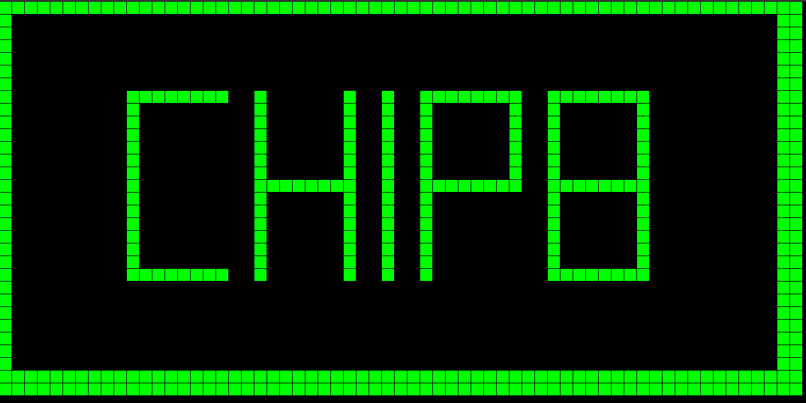
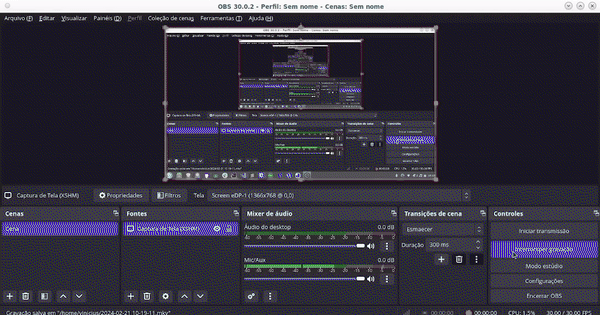
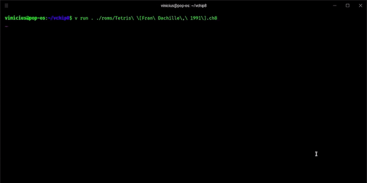
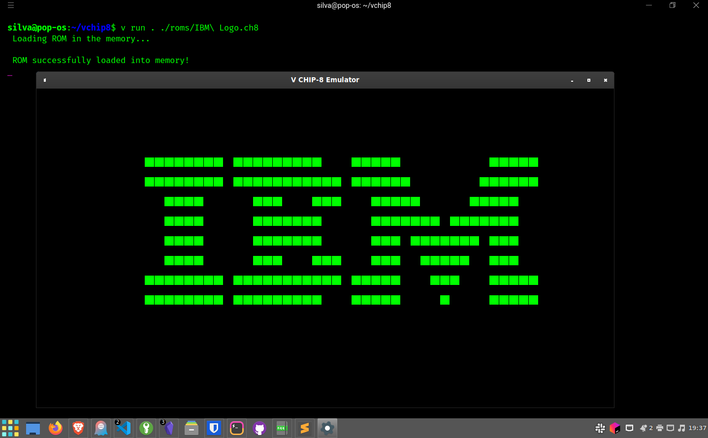
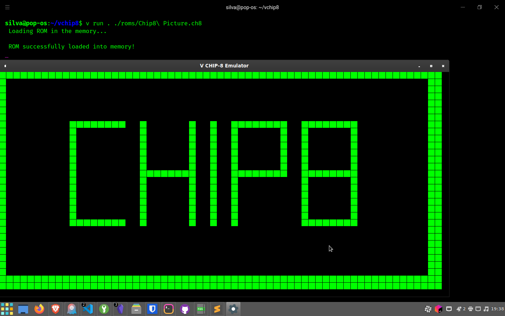

# What is CHIP8

The Chip-8 is an interpreted programming language originally designed to develop simple games on 1970s computers. Created by Joseph Weisbecker, Chip-8 employs a virtual architecture to simplify game and application programming, implementing a set of basic instructions interpreted by a specific emulator.

# Installation

For install V programming language see more in: 

```shell
git clone --branch main https://github.com/viniciusfdasilva/vchip8.git
```
```shell
cd vchip8
```
# Execution

```shell
v run . ./roms/[YOUR_ROM].ch8
```

# Result




